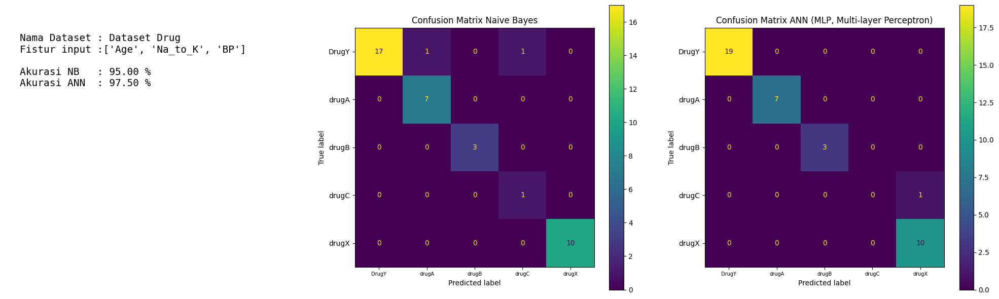
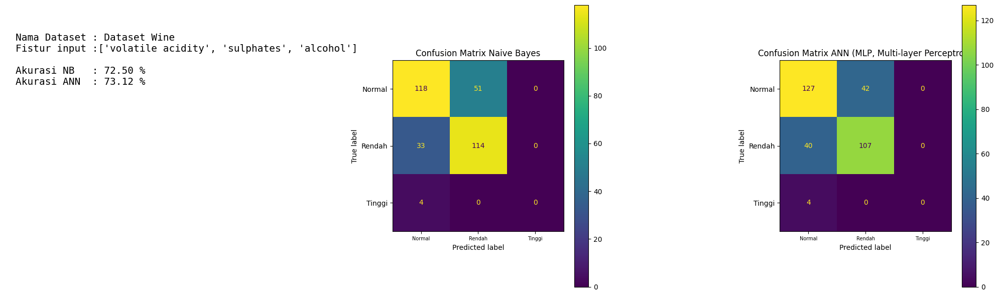
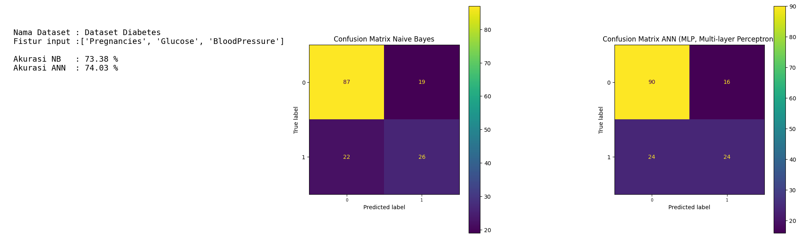

# 3Dataset_NaiveBayesian-ANN
Perbandingan 3 dataset dengan metode naive bayesian dan ANN (MLP, Multi layer Peceptron)

Hasil dari dataset drug:

Hasil dari dataset wine:

Hasil dari dataset diabetes:

Disusun:
1. Fadlur Rohman – 21060124420015
2. Melissa Rahmawati Yusuf – 21060124420018
3. Zakky Mizanulfikri Ash Sodiq – 21060124420021
4. Fauziyah Wafa’Abdillah – 21060124420023
